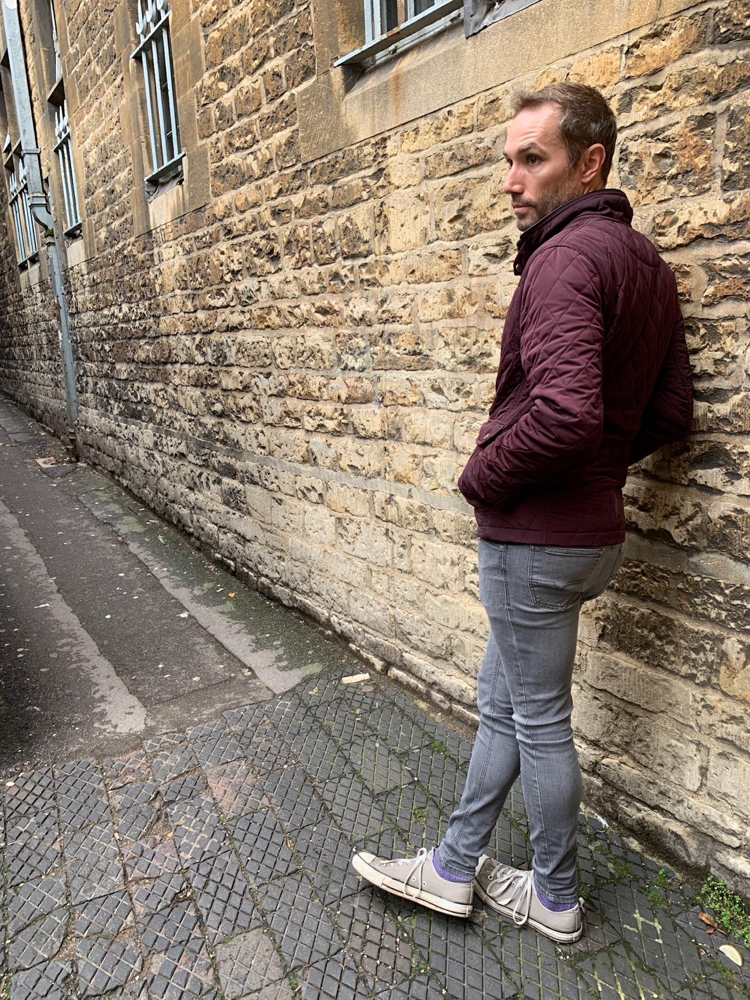
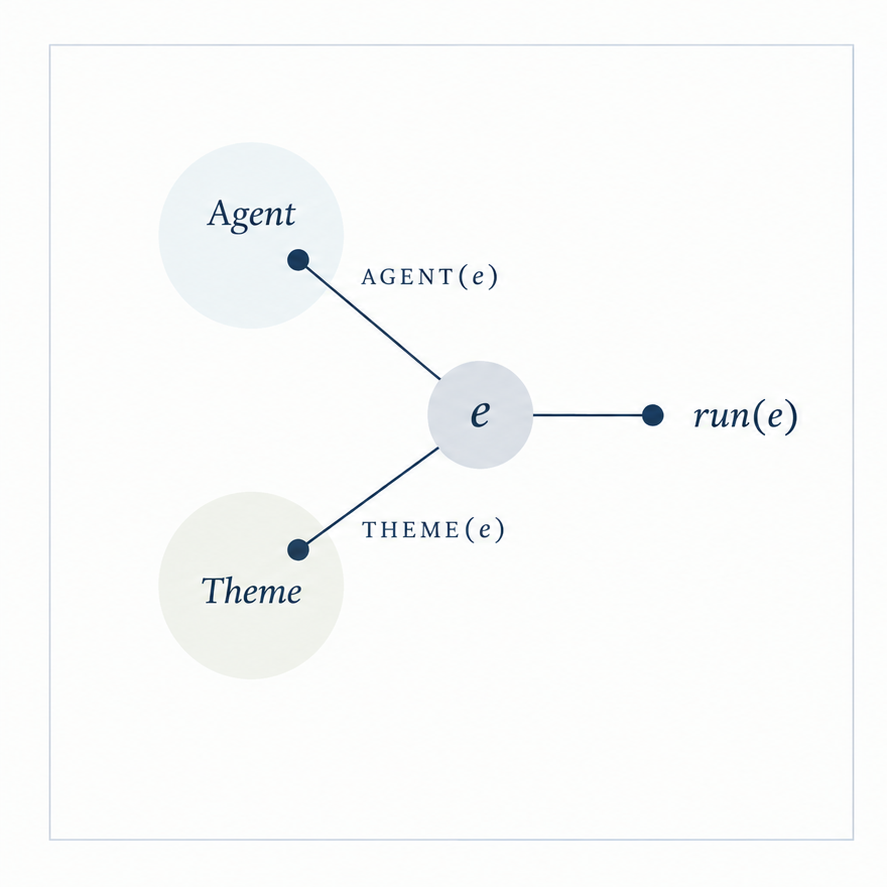
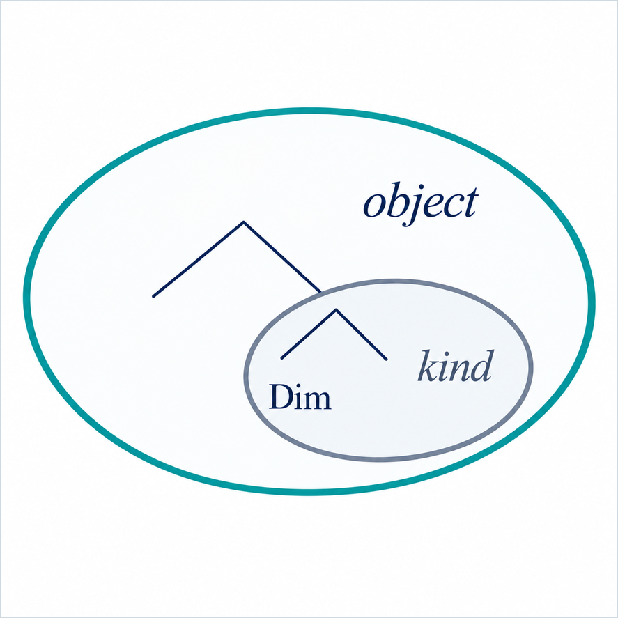
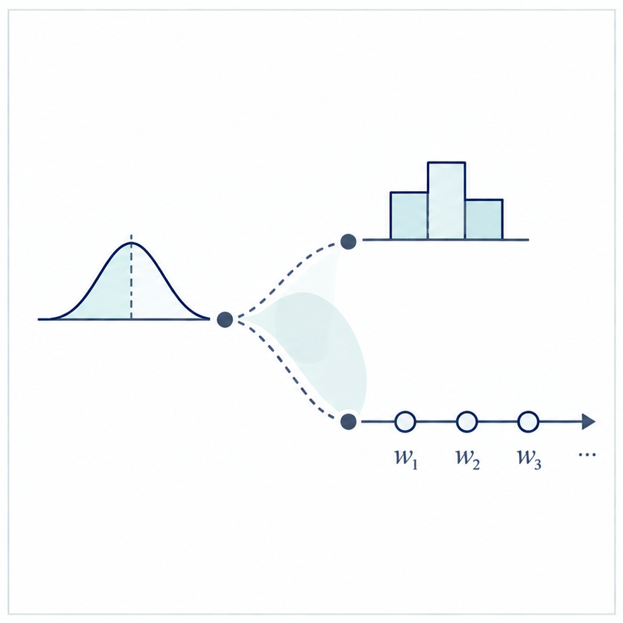
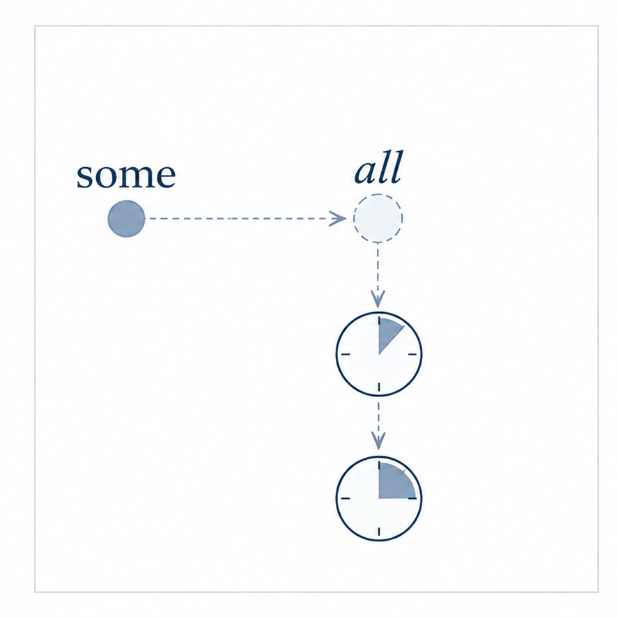
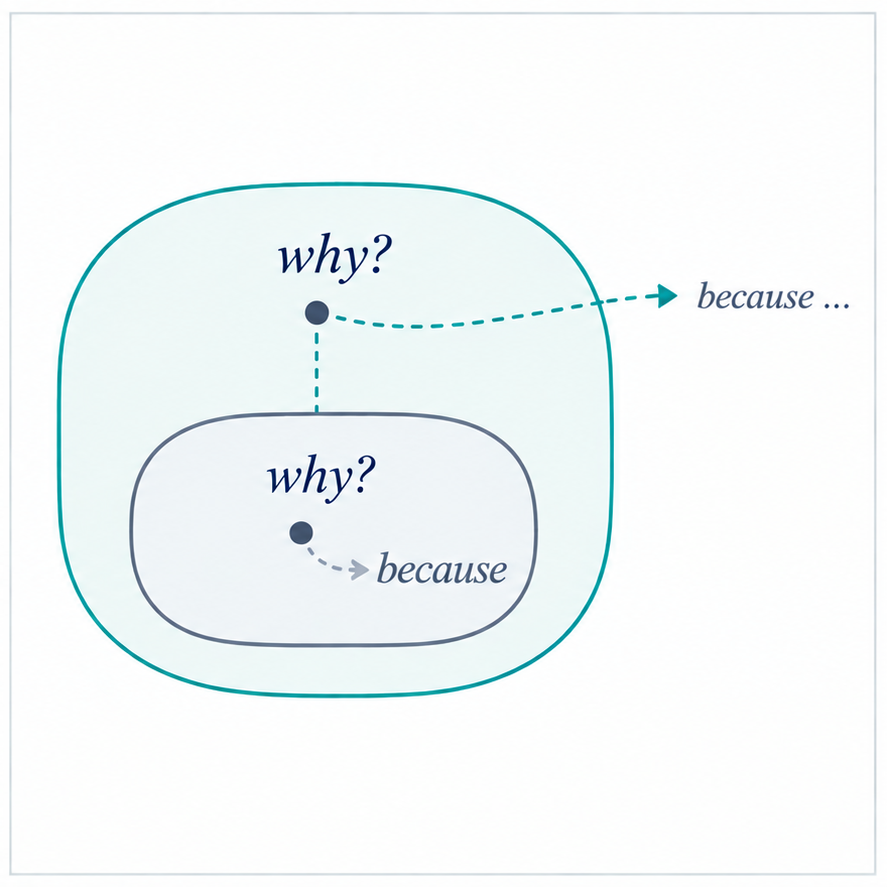
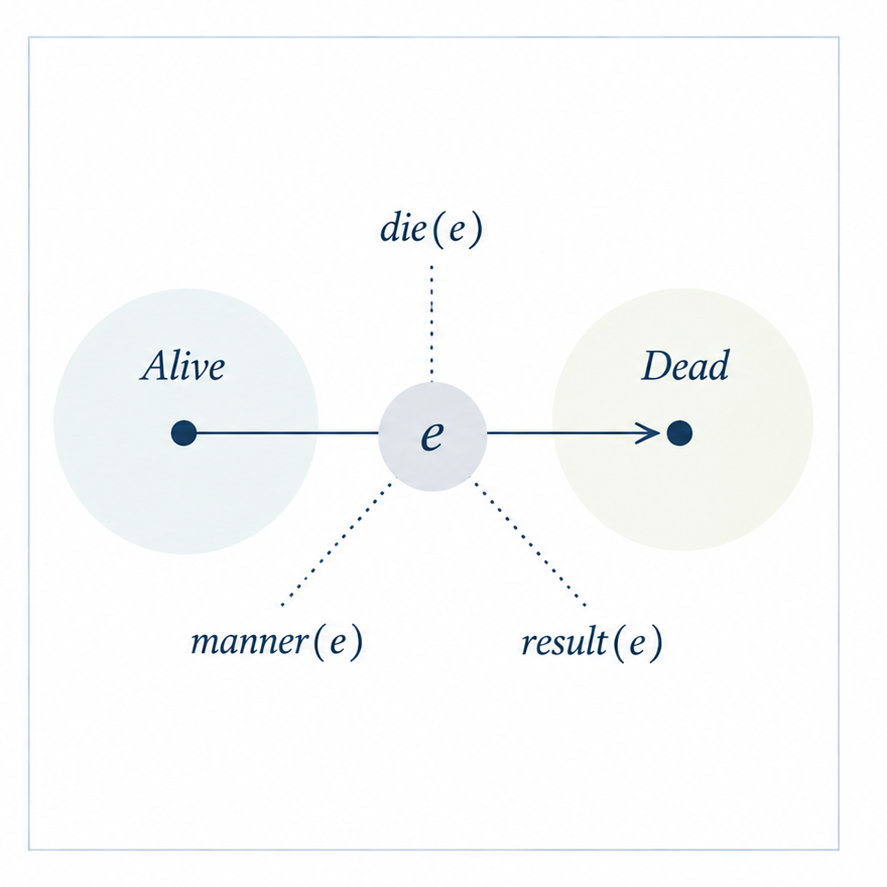

:::: {.me}

::: {.me-copy}

## E. Matthew Husband {.me-name}

Professor of Psycholinguistics · University of Oxford · St Hugh's College

## How does the mind represent and make use of meaning? {.me-question}

My research investigates how the mind represents and uses meaning, asking what forms and formats meaningful representations take, how they are constructed, enriched, and inferred by speakers and comprehenders, and how they are encoded to, organized in, and retrieved from memory.

My approach to these questions brings linguistic theory and experimental psycholinguistics together. Linguistic theory provides explicit hypotheses about the operations and structures that form meaningful representations. Psycholinguistic theory provides real-time hypotheses about the cognitive processes that construct and use the operations and structures of those representations. Empirical evidence is used to test the predictions that follow from both, providing complementary constraints on theories of meaning and cognition.

:::

::: {.me-side}

::: {.profile-frame}

:::

  
<a href="mailto:matthew.husband@ling-phil.ox.ac.uk" aria-label="Email">
    <svg class="link-icon" viewBox="0 0 24 24" aria-hidden="true"><rect x="3" y="5" width="18" height="14" rx="1.5" fill="none" stroke="currentColor" stroke-width="1.6"/><path d="M4 7l8 6 8-6" fill="none" stroke="currentColor" stroke-width="1.6"/></svg>
    Email
  </a>

  
<a href="https://scholar.google.com/citations?user=R-e8yNsAAAAJ" aria-label="Google Scholar">
    <svg class="link-icon" viewBox="0 0 24 24" aria-hidden="true"><path d="M4 9.2L12 5l8 4.2L12 13 4 9.2Z" fill="none" stroke="currentColor" stroke-width="1.6" stroke-linejoin="round"/><path d="M7 11.1v4.7c2.8 2 7.2 2 10 0v-4.7" fill="none" stroke="currentColor" stroke-width="1.6"/><path d="M20 9.2v4.6" fill="none" stroke="currentColor" stroke-width="1.6" stroke-linecap="round"/></svg>
    Google Scholar
  </a>

  
<a href="https://orcid.org/0000-0002-6446-5582" aria-label="ORCID">
    <svg class="link-icon" viewBox="0 0 24 24" aria-hidden="true"><circle cx="12" cy="12" r="8.5" fill="none" stroke="currentColor" stroke-width="1.6"/><circle cx="8.9" cy="9" r="1.2" fill="currentColor"/><path d="M9 11.5v4.7M12.2 11.5h1.4c2.8 0 2.8 4.7 0 4.7h-1.4v-4.7Z" fill="none" stroke="currentColor" stroke-width="1.5" stroke-linecap="round" stroke-linejoin="round"/></svg>
    ORCID
  </a>

  
<a href="https://github.com/emhusband" aria-label="GitHub">
    <svg class="link-icon" viewBox="0 0 24 24" aria-hidden="true"><path d="M12 4.1a7.9 7.9 0 0 0-2.5 15.4c.4.1.5-.2.5-.4v-1.5c-2 .4-2.4-.9-2.4-.9-.3-.9-.8-1.1-.8-1.1-.7-.5 0-.5 0-.5.8.1 1.2.8 1.2.8.7 1.2 1.8.9 2.2.7.1-.5.3-.9.5-1.1-1.6-.2-3.3-.8-3.3-3.5 0-.8.3-1.5.8-2-.1-.2-.4-.9.1-1.9 0 0 .7-.2 2.1.8a7.2 7.2 0 0 1 3.8 0c1.4-1 2.1-.8 2.1-.8.5 1 .2 1.7.1 1.9.5.5.2 1.7.1 1.9.5.5.8 1.2.8 2 0 2.7-1.7 3.3-3.3 3.5.3.3.5.7.5 1.4v2.1c0 .2.1.5.5.4A7.9 7.9 0 0 0 12 4.1Z" fill="currentColor"/></svg>
    GitHub
  </a>

:::

::::

<section class="section research-glance" id="research-at-a-glance">

::: {.section-head}

## Research at a glance

<a class="section-action" href="research/index.html">Explore the research →</a>
:::

</section>

<section class="section selected-work-section">

::: {.section-head}

Selected work

## Questions across the research programme

<a class="section-action" href="publications.html">View all publications →</a>
:::

:::: {.selected-item}

::: {.selected-copy}
**Thematic separation in light of sentence comprehension**  
Husband, E. M. · *Language and Linguistic Compass* · 2023

What does the grammatical representation of thematic relations commit us to when it comes to the processes that construct sentence meaning?

[DOI](https://doi.org/10.1111/lnc3.12496)
:::

::::

:::: {.selected-item}

::: {.selected-copy}
**Nothing much for kinds**  
Husband, E. M. · *For Hagit: A celebration* · 2022

How is the kind/object distinction shaped by grammatical representation?

[Open access](https://ora.ox.ac.uk/objects/uuid:7bc2eda6-3e05-4374-8aae-2fb6d471fc3e)
:::

::::

:::: {.selected-item}

::: {.selected-copy}
**Relating word prediction and probability judgment: Online and offline probabilistic processes are partially shared**  
Zhang, Y. & Husband, E. M. · *Proceedings of the Cognitive Science Society* · 2026

Do our explicit judgments about what is probable and our moment-to-moment expectations during comprehension draw on the same probabilistic representations and processes?

[Open access](https://escholarship.org/uc/item/113553v6)
:::

::::

:::: {.selected-item}

::: {.selected-copy}
**The impact of implicit scalar alternatives on the products of language comprehension: Evidence from recognition memory**  
Patson, N. & Husband, E. M. · *Memory & Cognition* · 2026

When the comprehension process makes implicit alternatives available, do those alternatives become part of the representation that persists in memory?

[DOI](https://doi.org/10.3758/s13421-026-01856-8)
:::

::::

:::: {.selected-item}

::: {.selected-copy}
**An incremental QUD approach to causal discourse expectations**  
Yao, R., Altshuler, D. & Husband, E. M. · *Acta Psychologica* · 2026

Can comprehenders' expectations about what comes next be explained by the questions that become relevant as a discourse evolves?

[DOI](https://doi.org/10.1016/j.actpsy.2026.107670)
:::

::::

:::: {.selected-item}

::: {.selected-copy}
**Speaking of death**  
Husband, E. M. · *Philosophical Transactions of the Royal Society B: Biological Sciences* · 2018

What does the way we grammatically encoded events tell us about how events themselves are represented in the mind?

[DOI](https://doi.org/10.1098/rstb.2018.0172)
:::

::::

</section>

<section class="section prospective-home">

::: {.section-head}

Prospective researchers

## Working with me

<a class="section-action" href="group.html#prospective-researchers">Information about working with me →</a>
:::

I welcome enquiries from prospective researchers interested in meaning, language, and cognition, particularly projects that connect linguistic, conceptual, and world knowledge representations to composition, inference, and memory processes in production and comprehension. I am especially interested in work that uses linguistic theory and experimental evidence to constrain one another.

Your project need not fall neatly within one of my current research programmes. I am much more interested in supervising work that is driven by a clear theoretical question about how meaning is represented, constructed, and/or used.

</section>

<footer class="footer-logos">

::: {.institution-row}

::: {.inst-mark}

O

<strong>University of Oxford</strong>Linguistics, Philology & Phonetics

:::

::: {.inst-mark}

SH

<strong>St Hugh's College</strong>University of Oxford

:::

:::

[Email](mailto:matthew.husband@ling-phil.ox.ac.uk) · [Google Scholar](https://scholar.google.com/citations?user=R-e8yNsAAAAJ) · [ORCID](https://orcid.org/0000-0002-6446-5582) · [GitHub](https://github.com/emhusband)

</footer>

